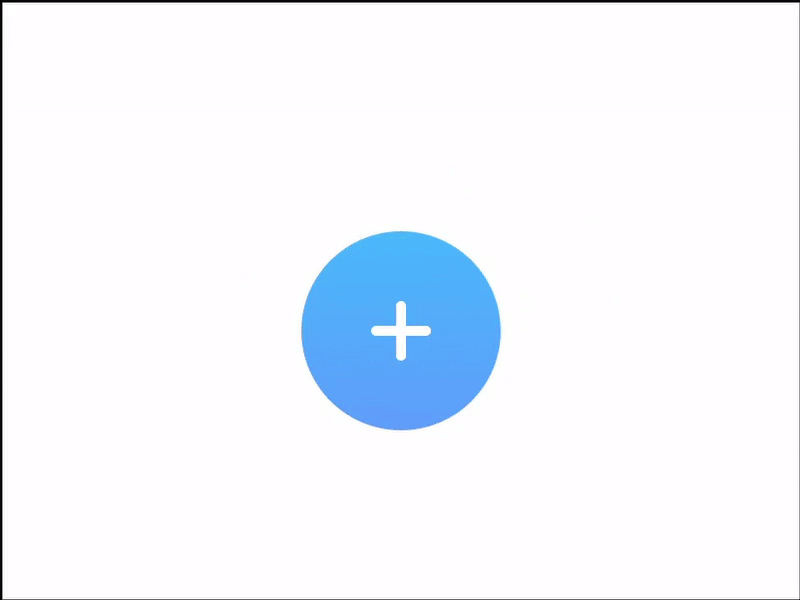

# Floating Button

Quite attractive, colorful, customizable UI component, known as floating button. Implemeted using SwiftUI.

## Preview


## Getting Started

### Prerequisites

Available as Swift Package. Just add it to your project as Package dependency and do whatever you want. However, don't forget to import the library.

```
import FloatingButton
```

### Installing

In order to add the button to any screen you want you need to add next lines to the body of your screen with default options:

```
var body: some View {
  FloatingButton(options: Options())
}
```

If you want to add some custom option, do like shown below:

```
var body: some View {
    FloatingButton(options: .init(buttonsOffset: 80,
                                  centralButtonSize: 50,
                                  sideButtonSize: 30,
                                  buttonIcons: .init(centralButtonIcon: "1",
                                                     leftButtonIcon: "2",
                                                     rightButtonIcon: "3",
                                                     topButtonIcon: "4"),
                                  buttonColors: .init(centralOpenedButtonColor: GradientColors(top: Color(red: 1.0, green: 0.7, blue: 0.25),
                                                                                               bottom: Color(red: 1.0, green: 0.35, blue: 0.35)),
                                                      centralClosedButtonColor: GradientColors(top: Color(red: 0.35, green: 0.77, blue: 1.0),
                                                                                               bottom: Color(red: 0.25, green: 0.42, blue: 1.0)),
                                                      leftButtonColor: GradientColors(top: Color(red: 0.35, green: 0.77, blue: 1.0),
                                                                                      bottom: Color(red: 0.25, green: 0.42, blue: 1.0)),
                                                      topButtonColor: GradientColors(top: Color(red: 0.9, green: 0.25, blue: 1.0),
                                                                                     bottom: Color(red: 0.4, green: 0.35, blue: 1.0)),
                                                      rightButtonColor: GradientColors(top: Color(red: 0.35, green: 1.0, blue: 0.46),
                                                                                       bottom: Color(red: 0.25, green: 0.73, blue: 1.0)))))
  }
}
```

In order to add some actions to side buttons, you need to do like this: 

```
var body: some View {
  FloatingButton(options: Options())
    .onRightButtonPress { print("Right") }
    .onLeftButtonPress { print("Left") }
    .onTopButtonPress { print("Top") }
}
```
